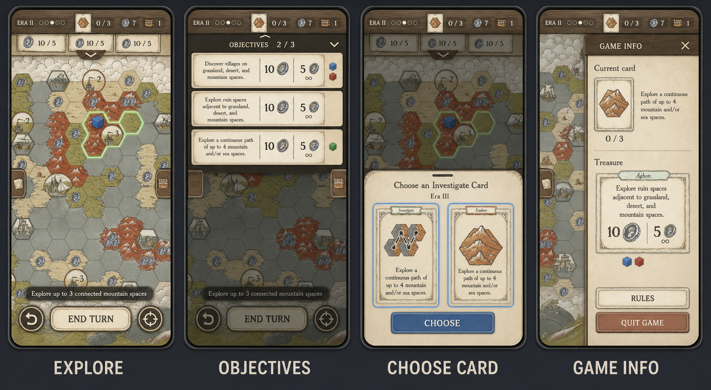

# Mobile game interface concept

This concept preserves the current desktop interface's spatial model while adapting each surface to a phone:

- The board is a persistent, full-screen pan-and-zoom canvas. Opening or closing a surface never resets its viewport.
- The current era, explorer-deck progress, current card and placement count, coins, and treasures remain visible in the compact top HUD.
- Objectives appear as shallow card tabs when collapsed and pull down from the top as a readable drawer.
- Current-card details, treasure cards, rules, and quit controls slide in from the right without moving the board.
- Forced choices rise from the bottom as a sheet, keeping enough of the board visible to preserve context.
- The current instruction and primary action live near the bottom thumb zone. Undo and recenter remain one tap away.
- Owned Investigate cards and treasure inventory use narrow edge tabs so their presence is visible without consuming map space.

## States shown

1. **Explore:** the normal board view, legal hexes highlighted, with compact persistent information and actions.
2. **Objectives:** an expanded top drawer showing all objectives, rewards, and claimed reward slots.
3. **Choose card:** a forced Investigate-card choice presented as a modal bottom sheet.
4. **Game info:** the current desktop right drawer translated to an 82%-width mobile overlay.

## Generation prompt

Use the supplied Aghon map, objective cards, mountain Explorer card, and Investigate card faithfully in a high-fidelity, shippable four-screen mobile UI concept. Show equal portrait phone screens for Explore, Objectives, Choose Card, and Game Info. Keep the map full bleed and reserve at least 75% of the default screen for it. Use a slim safe-area-aware top HUD containing Era II and deck pips, the current card with a 0/3 placement counter, 7 coins, and 1 treasure. Below it, show three shallow objective tabs with a pull handle. Put the contextual instruction in a translucent pill above a compact bottom action dock with Undo, End Turn, and Recenter.

For Explore, show legal mountain hexes and a blue explorer marker. For Objectives, pull a drawer down over 42% of the screen with three readable objectives and claimed reward markers. For Choose Card, raise a 58%-height parchment bottom sheet with two large Investigate-card choices and a Choose action. For Game Info, slide an 82%-width drawer in from the right with current-card details, treasure, Rules, and a subdued Quit Game action. Preserve map position and keep some board visible behind every expanded surface.

Extend the game's hand-inked parchment and weathered wood with ivory, muted sage, terracotta, slate, and restrained cobalt accents. Use modern touch spacing, soft shadows, clear hierarchy, and a clean humanist sans-serif for interface labels. Avoid extra navigation, desktop chrome, fake branding, unrelated fantasy imagery, duplicated controls, and illegible microcopy.
